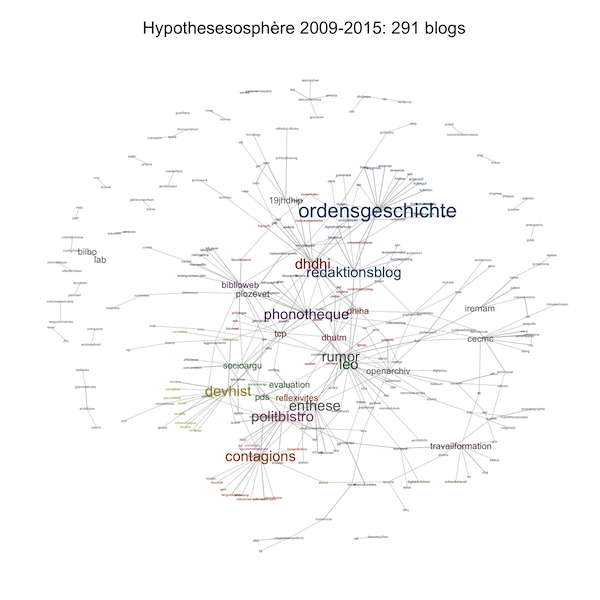

R code to plot the citation network of [Hypothèses](http://hypotheses.org/) blogs. See [this blog post](http://politbistro.hypotheses.org/2737) (in French). To replicate, move all scripts from the `code` folder to the main directory, and run in the indicated order.

The `data` folder contains the [list of all Hypothèses blogs](data/blogs.csv) ([source](http://www.openedition.org/catalogue-notebooks)) as of June 2015, and an [example of a corpus](data/corpus.csv) assembled from that seed list.

The most sensitive parameters of the scripts are the [fraction of blog posts](code/02-get-posts.r#L20) that should be downloaded, and the [number of topics](code/06-get-topics.r#L32-L34) to model from their keywords.

